# Architecture

## Architecture (Three Layers)

1. **Traffic Simulation**

- Generate realistic traffic using [SUMO](https://eclipse.dev/sumo/) and its scenarios such as [NUMo](https://github.com/ToyotaInfoTech/numo).
- Pull per-vehicle state via [TraCI](https://sumo.dlr.de/docs/TraCI/) (e.g., speed, position, lane).

2. **Distributed Edge**

- Distribute vehicles across a Ray cluster, where the head node is called **World** and worker nodes are called **Places**.
- The World creates Places and load-balances vehicle assignments across **Edge** instances (which are the liaisons with on-board unit software).
- Each Place manages multiple Edge instances that communicate with pseudo on-board units, namely **OBU** (`ouroedge` processes) via IPC using Unix Domain Sockets.
- The World, Places, and Edges distribute simulated sensor data from the traffic simulator; `ouroedge` detects events, stores data locally, and publishes metadata.

3. **Cloud Center**

- Persist and index metadata for analysis (e.g., TimescaleDB on PostgreSQL).
- Provide dashboards and command-line interfaces (CLI), which allow users to monitor and query the states of data collection workflows.
- Issue adaptive instructions and update collection conditions.

### Overall Architecture

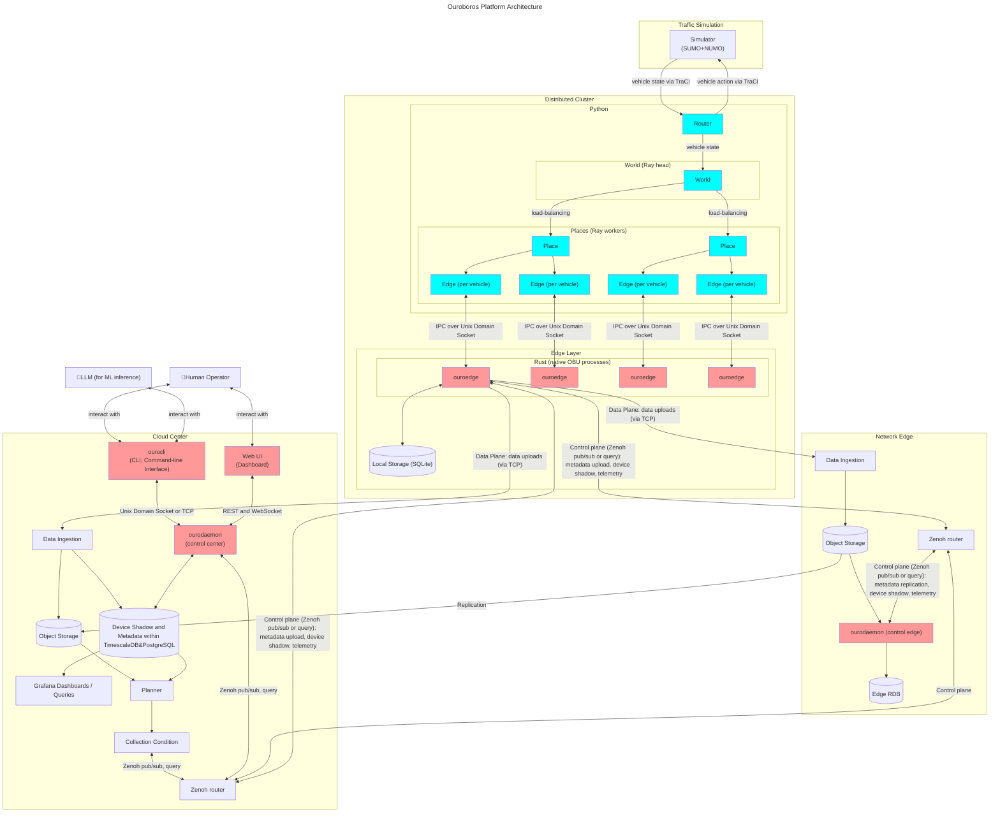
```mermaid
---
title: "Ouroboros Platform Architecture"
---
flowchart TB
  subgraph TS["Traffic Simulation"]
        Sim["Simulator<br/>(SUMO+NUMO)"]
    end

  subgraph DE["Distributed Cluster"]

    subgraph Python["Python"]

        Router[Router]
        style Router fill:#00ffff

        Sim-->|vehicle state via TraCI|Router
        Router-->|vehicle action via TraCI|Sim

        Router-->|vehicle state|World

        subgraph WorldGraph["World (Ray head)"]
            World[World]
        end

        subgraph Places["Places (Ray workers)"]
            Place1[Place]
            PlaceM[Place]
        end
        style Place1 fill:#00ffff
        style PlaceM fill:#00ffff

        subgraph Places["Places (Ray workers)"]
            Edge1_1["Edge (per vehicle)"]
            Edge1_N["Edge (per vehicle)"]
            Edge2_1["Edge (per vehicle)"]
            Edge2_N["Edge (per vehicle)"]
        end
        style Edge1_1 fill:#00ffff
        style Edge1_N fill:#00ffff
        style Edge2_1 fill:#00ffff
        style Edge2_N fill:#00ffff
    end
        World -->|load-balancing|Place1
        World -->|load-balancing|PlaceM
        style World fill:#00ffff

        Edge1_1 <-->|IPC over Unix Domain Socket|OBU1
        Edge1_N <-->|IPC over Unix Domain Socket|OBU2
        Edge2_1 <-->|IPC over Unix Domain Socket|OBU3
        Edge2_N <-->|IPC over Unix Domain Socket|OBU4

        subgraph EdgeLayer["Edge Layer"]
            subgraph Rust["Rust (native OBU processes)"]
                OBU1["ouroedge"]
                OBU2["ouroedge"]
                OBU3["ouroedge"]
                OBU4["ouroedge"]
            end
            style OBU1 fill:#ff9999
            style OBU2 fill:#ff9999
            style OBU3 fill:#ff9999
            style OBU4 fill:#ff9999
            LocalStore[("Local Storage (SQLite)")]
            OBU1 <--> LocalStore
        end

        Place1 --> Edge1_1
        Place1 --> Edge1_N
        PlaceM --> Edge2_1
        PlaceM --> Edge2_N
    end

    subgraph NE["Network Edge"]
        EdgeZRouter["Zenoh router"]
        EdgeDaemon["ourodaemon (control edge)"]
        style EdgeDaemon fill:#ff9999
        EdgeRDB[("Edge RDB")]
        EdgeIngestion["Data Ingestion"]
        EdgeOBS[("Object Storage")]

        EdgeDaemon --> EdgeRDB
        EdgeIngestion --> EdgeOBS
        EdgeOBS --> EdgeDaemon
    end

    LLM["🤖LLM (for ML inference)"]

    HO["👦Human Operator"]

    HO <-->|interact with| CLI
    LLM <-->|interact with| CLI
    HO <-->|interact with| WebUI

    subgraph CC["Cloud Center"]
        Daemon["ourodaemon<br/>(control center)"]
        style Daemon fill:#ff9999
        WebUI["Web UI<br/>(Dashboard)"]
        style WebUI fill:#ff9999
        CLI["ourocli<br/>(CLI, Command-line Interface)"]
        style CLI fill:#ff9999
        ZRouter["Zenoh router"]

        Ingestion["Data Ingestion"]

        OBS[("Object Storage")]
        CoCo["Collection Condition"]

        RDB[("Device Shadow and Metadata within TimescaleDB&PostgreSQL")]
        Dash[Grafana Dashboards / Queries]
        Planner["Planner"]
        Ingestion --> OBS
        Ingestion --> RDB
        CLI <-->|Unix Domain Socket or TCP| Daemon
        WebUI <-->|REST and WebSocket| Daemon
        Daemon <--> RDB
        RDB --> Dash
        OBS --> Planner
        RDB --> Planner
        Planner --> CoCo
        CoCo <-->|Zenoh pub/sub, query|ZRouter
        Daemon <-->|Zenoh pub/sub, query|ZRouter
    end

    OBU1 <--> |"Control plane (Zenoh pub/sub or query): metadata upload, device shadow, telemetry"|EdgeZRouter
    EdgeZRouter <--> |"Control plane (Zenoh pub/sub or query): metadata replication, device shadow, telemetry"|EdgeDaemon
    EdgeZRouter <--> |"Control plane"|ZRouter
    OBU1 <--> |"Control plane (Zenoh pub/sub or query): metadata upload, device shadow, telemetry"|ZRouter
    OBU1 -->|"Data Plane: data uploads (via TCP)"|Ingestion
    OBU1 -->|"Data Plane: data uploads (via TCP)"|EdgeIngestion
    EdgeOBS -->|Replication| OBS
    %%EdgeDaemon -->|"Control Plane: metadata replication"| ZRouter
```

## Component Relationship

### Edge Runtime Components

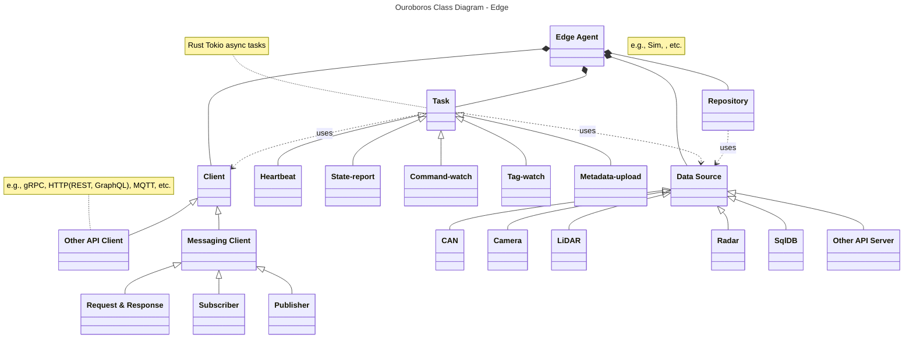
```mermaid
---
title: "Ouroboros Class Diagram - Edge"
---
classDiagram
    class EdgeAgent["Edge Agent"]
    class Task
    class Repository
    class DataSource["Data Source"]
    class Client
    class APIC["Other API Client"]

    class MC["Messaging Client"]
    class RR["Request & Response"]
    class Subscriber
    class Publisher
    
    class CAN
    class Camera
    class LiDAR
    class Radar
    class SqlDB
    class APIS["Other API Server"]

    class HB["Heartbeat"]
    class SR["State-report"]
    class CW["Command-watch"]
    class TW["Tag-watch"]
    class MD["Metadata-upload"]

    EdgeAgent *-- Task
    note for Task "Rust Tokio async tasks"
    Task <|-- HB
    Task <|-- SR
    Task <|-- CW
    Task <|-- TW
    Task <|-- MD

    EdgeAgent *-- Client
    Client <|-- MC
    Client <|-- APIC
    note for APIC "e.g., gRPC, HTTP(REST, GraphQL), MQTT, etc."

    MC <|-- RR
    MC <|-- Subscriber
    MC <|-- Publisher

    EdgeAgent *-- Repository

    EdgeAgent *-- DataSource
    DataSource <|-- CAN
    DataSource <|-- Camera
    DataSource <|-- LiDAR
    DataSource <|-- Radar
    DataSource <|-- SqlDB
    DataSource <|-- APIS
    note for OtherApi "e.g., Sim, , etc."

    Task ..> DataSource : uses
    Task ..> Client : uses
    Repository ..> DataSource : uses
```

### Daemon Runtime Components

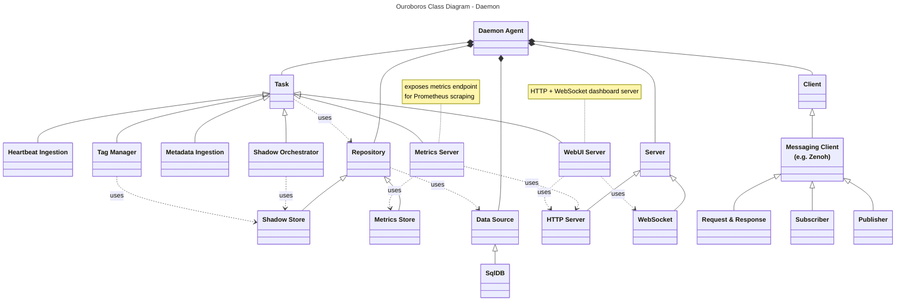
```mermaid
---
title: "Ouroboros Class Diagram - Daemon"
---
classDiagram
    class DaemonAgent["Daemon Agent"]
    class Task
    class HBI["Heartbeat Ingestion"]
    class SO["Shadow Orchestrator"]
    class MI["Metadata Ingestion"]
    class MS["Metrics Server"]
    class TM["Tag Manager"]
    class WU["WebUI Server"]
    note for MS "exposes metrics endpoint<br/>for Prometheus scraping"
    note for WU "HTTP + WebSocket dashboard server"

    class Repository
    class SS["Shadow Store"]
    class MetricsStore["Metrics Store"]
    
    class DataSource["Data Source"]

    class Server
    class HS["HTTP Server"]
    class WS["WebSocket"]

    class Client
    class MC["Messaging Client<br/>(e.g. Zenoh)"]
    class RR["Request & Response"]

    DaemonAgent *-- Task
    Task <|-- MI
    Task <|-- HBI
    Task <|-- SO
    Task <|-- MS
    Task <|-- TM
    Task <|-- WU

    DaemonAgent *-- Repository
    Repository <|-- SS
    Repository <|-- MetricsStore

    SO ..> SS : uses
    TM ..> SS : uses
    MS ..> MetricsStore : uses

    DaemonAgent *-- Server
    Server <|-- HS
    Server <|-- WS

    MS ..> HS : uses
    WU ..> HS : uses
    WU ..> WS : uses

    DaemonAgent *-- Client
    Client <|-- MC
    
    MC <|-- RR
    MC <|-- Subscriber
    MC <|-- Publisher

    DaemonAgent *-- DataSource
    DataSource <|-- SqlDB

    %%Task ..> DataSource : uses
    %%Task ..> Client : uses
    %%Task ..> Server : uses
    Task ..>Repository : uses
    Repository ..> DataSource : uses

```

## Task Lifecycle

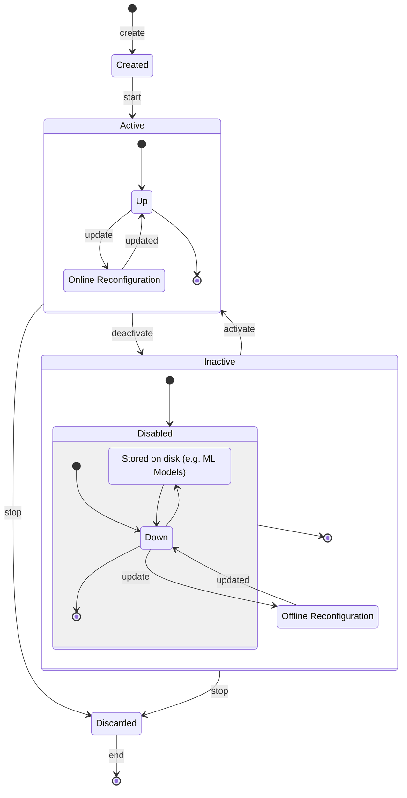
```mermaid
stateDiagram-v2
    Up: Up
    StateUpdate: Online Reconfiguration

    state Active {

        [*] --> Up
        Up --> StateUpdate: update
        Up --> [*]

        StateUpdate --> Up: updated
    }

    state Inactive {
        [*] --> Disabled
        state Disabled {
          Stored: Stored on disk (e.g. ML Models)
          [*] --> Down
          Down --> Stored
          Stored --> Down
          Down --> OffRC: update
          OffRC --> Down: updated
          Down --> [*]
        }

        OffRC: Offline Reconfiguration

        Disabled --> [*]

    }

    [*] --> Created: create
    Created --> Active: start
    Active --> Inactive: deactivate
    Inactive --> Active: activate
    Active --> Discarded: stop
    Inactive --> Discarded: stop

    Discarded --> [*]: end
```

## Inter-component Communication

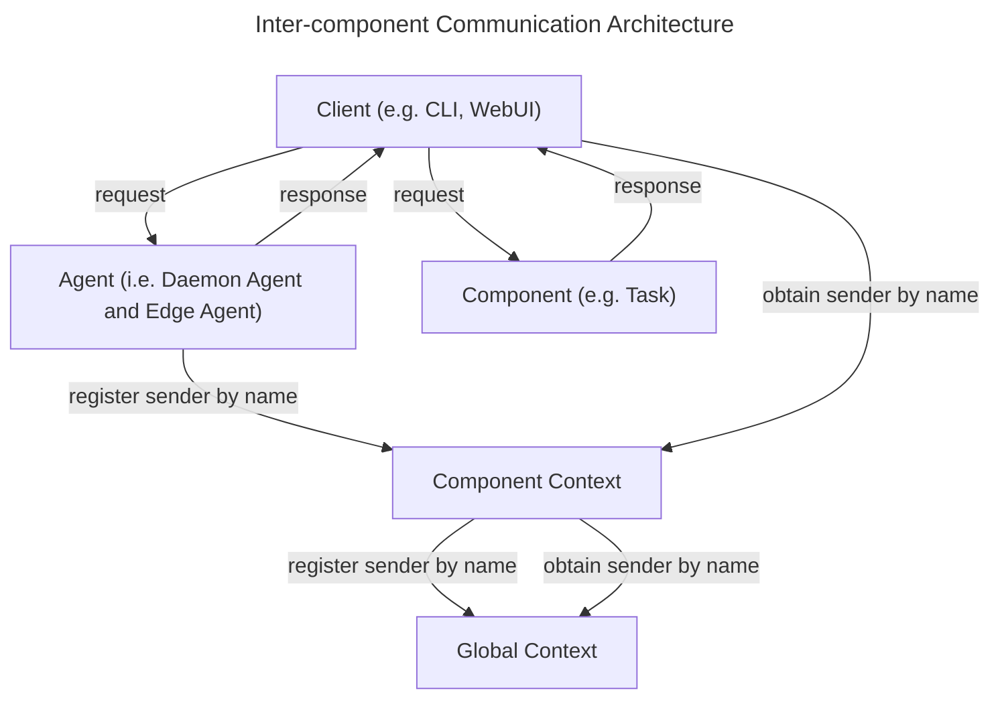
```mermaid
---
title: "Inter-component Communication Architecture"
---
flowchart TB
    Client["Client (e.g. CLI, WebUI)"]
    GC["Global Context"]
    Agent["Agent (i.e. Daemon Agent and Edge Agent)"]
    Comp["Component (e.g. Task)"]
    CC["Component Context"]

    Agent -->|register sender by name| CC
    CC -->|register sender by name| GC
    Client -->|obtain sender by name| CC
    CC -->|obtain sender by name| GC

    Client -->|request| Agent
    Agent -->|response| Client

    Client -->|request| Comp
    Comp -->|response| Client

```

## State

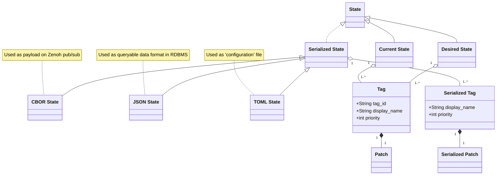
```mermaid
classDiagram
    class State
    class DesiredState["Desired State"]
    class CurrentState["Current State"]

    class SerializedState["Serialized State"]
    class CborState["CBOR State"]
    note for CborState "Used as payload on Zenoh pub/sub"
    class JsonState["JSON State"]
    note for JsonState "Used as queryable data format in RDBMS"
    class TomlState["TOML State"]
    note for TomlState "Used as 'configuration' file"

    class Tag["Tag"]{
        +String tag_id
        +String display_name
        +int priority
    }
    class Patch["Patch"]
    
    State <|-- DesiredState
    State <|-- CurrentState
    CurrentState "1" o-- "1..*" Tag
    DesiredState "1" o-- "1..*" Tag
    Tag "1" *-- "1" Patch

    class SerializedTag["Serialized Tag"]{
        +String display_name
        +int priority
    }
    
    class SerializedPatch["Serialized Patch"]

    State <|.. SerializedState
    SerializedState <|-- CborState
    SerializedState <|-- JsonState
    SerializedState <|-- TomlState

    SerializedState "1" o-- "1..*" SerializedTag

    SerializedTag "1" *-- "1" SerializedPatch
```

## Sequence Diagrams

### Heartbeat (periodic)

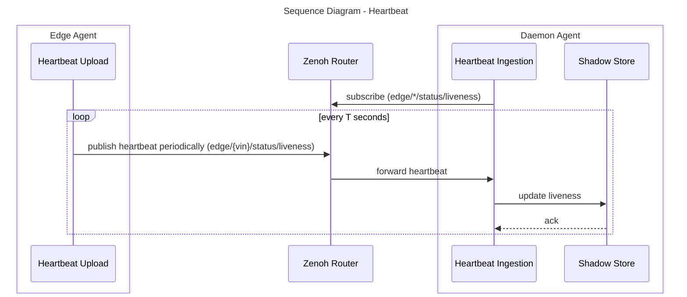
```mermaid
---
title: "Sequence Diagram - Heartbeat"
---

sequenceDiagram
    box Edge Agent
      participant HB as Heartbeat Upload
    end
    participant ZR as Zenoh Router
    box Daemon Agent
      participant HI as Heartbeat Ingestion
      participant ShadowStore as Shadow Store
    end

    HI->>ZR: subscribe (edge/*/status/liveness)

    loop every T seconds
        HB->>ZR: publish heartbeat periodically (edge/{vin}/status/liveness)
        ZR->>HI: forward heartbeat
        HI->>ShadowStore: update liveness
        ShadowStore-->>HI: ack
    end
```

### State Report

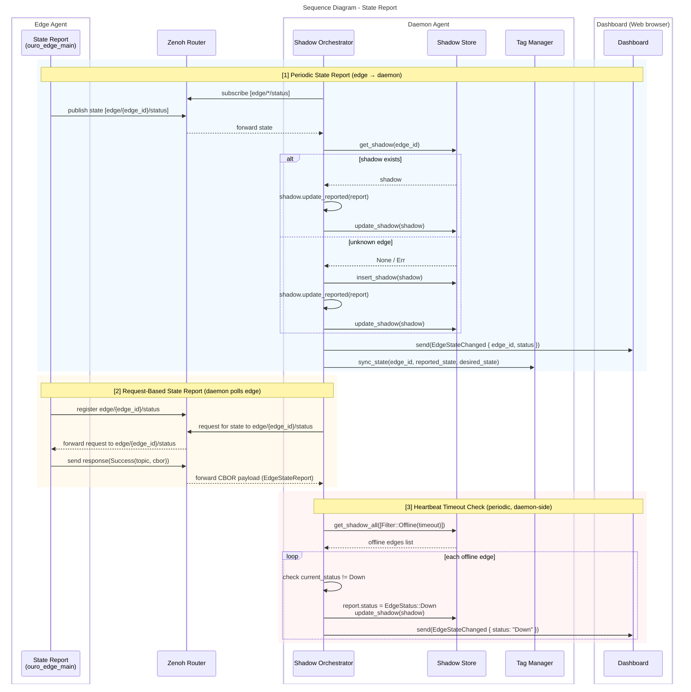
```mermaid

---
title: "Sequence Diagram - State Report"
---

sequenceDiagram
    box Edge Agent
      participant SR as State Report<br/>(ouro_edge_main)
    end
    participant ZR as Zenoh Router
    box Daemon Agent
      participant SO as Shadow Orchestrator
      participant Store as Shadow Store
      participant TagMgr as Tag Manager
    end
    box Dashboard (Web browser)
      participant Dashboard as Dashboard
    end

    rect rgba(230, 245, 255, 0.5)
        Note over SR, Dashboard: [1] Periodic State Report (edge → daemon)

        SO ->> ZR: subscribe [edge/*/status]

        SR ->> ZR: publish state [edge/{edge_id}/status]

        ZR -->> SO: forward state
        SO ->> Store: get_shadow(edge_id)

        alt shadow exists
            Store -->> SO: shadow
            SO ->> SO: shadow.update_reported(report)
            SO ->> Store: update_shadow(shadow)
        else unknown edge
            Store -->> SO: None / Err
            SO ->> Store: insert_shadow(shadow)
            SO ->> SO: shadow.update_reported(report)
            SO ->> Store: update_shadow(shadow)
        end

        SO ->> Dashboard: send(EdgeStateChanged { edge_id, status })
        SO ->> TagMgr: sync_state(edge_id, reported_state, desired_state)
    end

    rect rgba(255, 245, 220, 0.5)
        Note over SR, SO: [2] Request-Based State Report (daemon polls edge)

        SR ->> ZR: register edge/{edge_id}/status
        SO ->> ZR: request for state to edge/{edge_id}/status
        ZR -->> SR: forward request to edge/{edge_id}/status
        SR ->> ZR: send response(Success(topic, cbor))
        ZR -->> SO: forward CBOR payload (EdgeStateReport)
    end


    rect rgba(255, 235, 235, 0.5)
        Note over SO, Dashboard: [3] Heartbeat Timeout Check (periodic, daemon-side)

        SO ->> Store: get_shadow_all([Filter::Offline(timeout)])
        Store -->> SO: offline edges list

        loop each offline edge
            SO ->> SO: check current_status != Down
            SO ->> Store: report.status = EdgeStatus::Down<br/>update_shadow(shadow)
            SO ->> Dashboard: send(EdgeStateChanged { status: "Down" })
        end
    end
```

### Device Shadow Sync

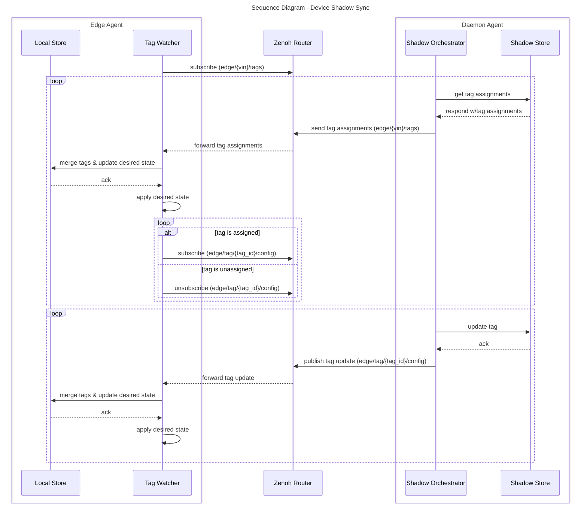
```mermaid
---
title: "Sequence Diagram - Device Shadow Sync"
---

sequenceDiagram
    box Edge Agent
      participant LS as Local Store
      participant TW as Tag Watcher
    end
    participant ZR as Zenoh Router
    box Daemon Agent
      participant SO as Shadow Orchestrator
      participant SS as Shadow Store
    end

    TW->>ZR: subscribe (edge/{vin}/tags)

    loop
      SO->>SS: get tag assignments
      SS-->>SO: respond w/tag assignments
      SO->>ZR: send tag assignments (edge/{vin}/tags)
      ZR-->>TW: forward tag assignments
      TW->>LS: merge tags & update desired state
      LS-->>TW: ack
      TW->>TW: apply desired state
      loop
        alt tag is assigned
          TW->>ZR: subscribe (edge/tag/{tag_id}/config)
        else tag is unassigned
          TW->>ZR: unsubscribe (edge/tag/{tag_id}/config)
        end
      end
    end

    loop
      SO->>SS: update tag
      SS-->>SO: ack
      SO->>ZR: publish tag update (edge/tag/{tag_id}/config)
      ZR-->>TW: forward tag update
      TW->>LS: merge tags & update desired state
      LS-->>TW: ack
      TW->>TW: apply desired state
    end
```

### Metadata Upload (push)

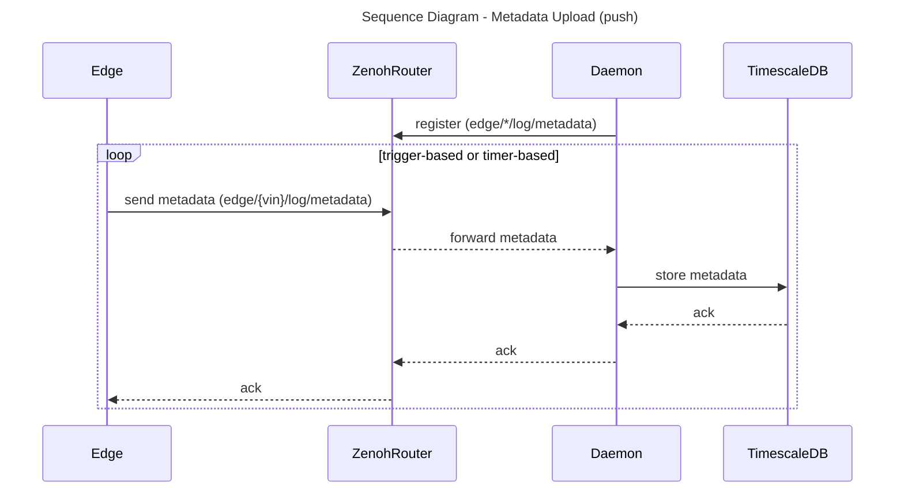
```mermaid

---
title: "Sequence Diagram - Metadata Upload (push)"
---

sequenceDiagram
    participant Edge
    participant ZenohRouter
    participant Daemon
    participant TimescaleDB

    Daemon->>ZenohRouter: register (edge/*/log/metadata)

    loop trigger-based or timer-based
        Edge->>ZenohRouter: send metadata (edge/{vin}/log/metadata)
        ZenohRouter-->>Daemon: forward metadata
        Daemon->>TimescaleDB: store metadata
        TimescaleDB-->>Daemon: ack
        Daemon-->>ZenohRouter: ack
        ZenohRouter-->>Edge: ack
    end

```

### Metadata Upload (pull)

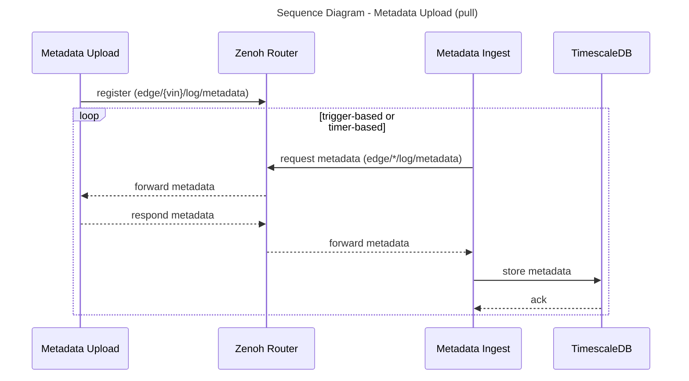
```mermaid
---
title: "Sequence Diagram - Metadata Upload (pull)"
---

sequenceDiagram
    participant MD as Metadata Upload
    participant ZR as Zenoh Router
    participant MDI as Metadata Ingest
    participant TimescaleDB

    MD->>ZR: register (edge/{vin}/log/metadata)

    loop trigger-based or timer-based
        MDI->>ZR: request metadata (edge/*/log/metadata)
        ZR-->>MD: forward metadata
        MD-->>ZR: respond metadata
        ZR-->>MDI: forward metadata
        MDI->>TimescaleDB: store metadata
        TimescaleDB-->>MDI: ack
    end

```

### Behavior Injection

The platform includes a behavior injection framework that introduces realistic abnormal driving patterns (e.g., hard braking, signal violations) into the simulation at configurable probabilities.
This enables testing of anomaly detection, metadata tagging, and data collection strategies under controlled conditions.

#### Behavior Lifecycle

Each behavior follows a `begin → tick → end` lifecycle managed by a per-vehicle `BehaviorRuntime`.
On each simulation tick, the runtime either advances a running behavior or probabilistically activates a new one from the enabled set.

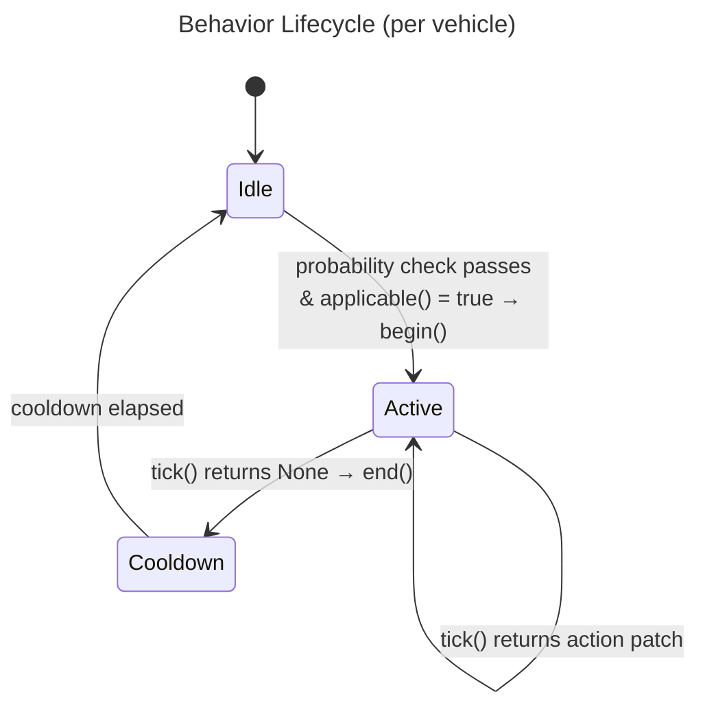
```mermaid
---
title: "Behavior Lifecycle (per vehicle)"
---
stateDiagram-v2
    state "Idle" as Idle
    state "Cooldown" as Cooldown
    state "Active" as Active

    [*] --> Idle
    Idle --> Active: probability check passes<br/>& applicable() = true → begin()
    Active --> Active: tick() returns action patch
    Active --> Cooldown: tick() returns None → end()
    Cooldown --> Idle: cooldown elapsed
```

#### Available Behaviors

Behaviors are defined as Python classes using the `@behavior(name=..., weight=...)` decorator, or declaratively as TOML files.
The built-in `pack_dangerous` pack provides the following behaviors:

| Behavior | Description |
| ---------- | ------------- |
| `hard_brake` | Sudden deceleration to zero speed |
| `jerk_accel` | Abrupt aggressive acceleration |
| `lane_depart` | Lateral drift out of the current lane |
| `minor_collision` | Simulated near-miss / low-speed impact |
| `red_light_run` | Ignoring traffic signal at intersection |
| `sharp_steer` | Sudden steering input |
| `wrong_way` | Driving against traffic flow |

#### Data Flow: Behavior → Metadata → WebUI

When a behavior is active, the behavior name is propagated through the entire data pipeline so it can be correlated with telemetry data in the cloud.

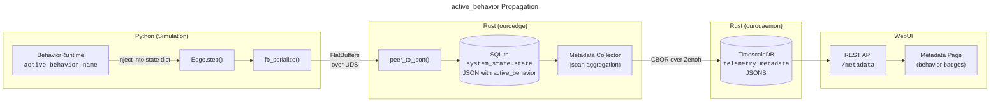
```mermaid
---
title: "active_behavior Propagation"
---
flowchart LR
    subgraph Python ["Python (Simulation)"]
        BR["BehaviorRuntime<br/><code>active_behavior_name</code>"]
        Edge["Edge.step()"]
        FBS["fb_serialize()"]
        BR -->|"inject into state dict"| Edge
        Edge --> FBS
    end

    subgraph RustEdge ["Rust (ouroedge)"]
        P2J["peer_to_json()"]
        SQLite[("SQLite<br/><code>system_state.state</code><br/>JSON with active_behavior")]
        MDCollect["Metadata Collector<br/>(span aggregation)"]
        P2J --> SQLite
        SQLite --> MDCollect
    end

    subgraph RustDaemon ["Rust (ourodaemon)"]
        TSDB[("TimescaleDB<br/><code>telemetry.metadata</code><br/>JSONB")]
    end

    subgraph WebUI ["WebUI"]
        API["REST API<br/><code>/metadata</code>"]
        Page["Metadata Page<br/>(behavior badges)"]
        API --> Page
    end

    FBS -->|"FlatBuffers<br/>over UDS"| P2J
    MDCollect -->|"CBOR over Zenoh"| TSDB
    TSDB --> API
```

The edge-side metadata collector aggregates per-tick `active_behavior` markers into time spans.
Consecutive ticks with the same behavior name are collapsed into a single `ActiveBehavior { name, start_time, end_time }` record within each metadata window.
The WebUI displays these as badges on the metadata list, with hover tooltips showing the time range.

## Resiliency Design

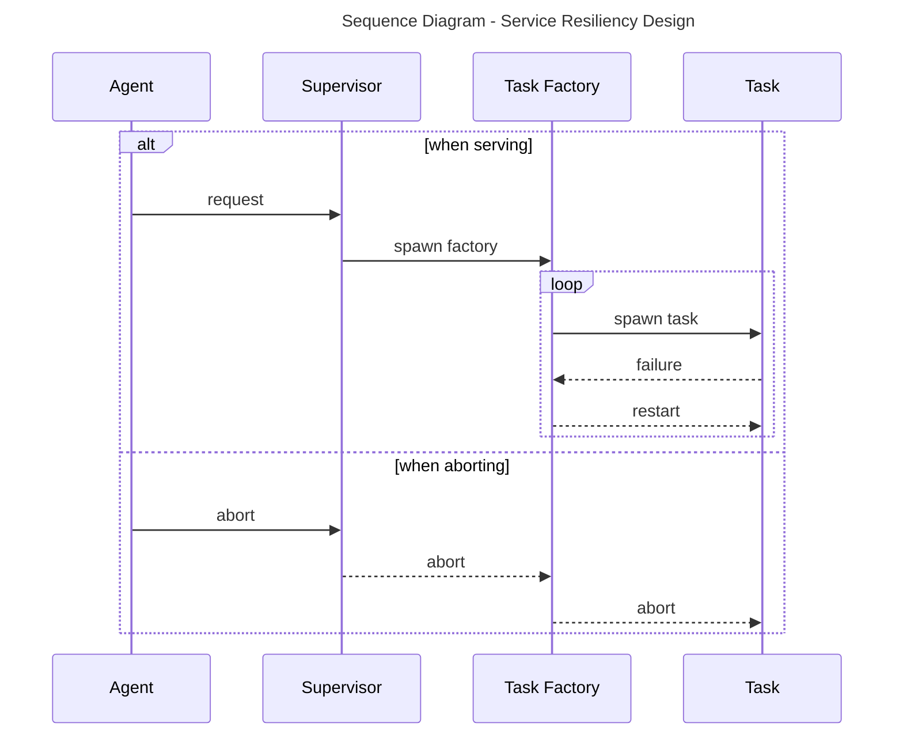
```mermaid

---
title: "Sequence Diagram - Service Resiliency Design"
---

sequenceDiagram
    participant Agent
    participant Supervisor
    participant TF as Task Factory
    participant Task

    alt when serving
      Agent->>Supervisor: request
      Supervisor->>TF: spawn factory

      loop
          TF->>Task: spawn task
          Task-->>TF: failure
          TF-->>Task: restart
      end
    else when aborting
      Agent->>Supervisor: abort
      Supervisor-->>TF: abort
      TF-->>Task: abort
    end

```

### Tag Management

The daemon provides a tag-based configuration overlay system for edge devices.
Tags are named `EdgeSpecPatch` objects with a merge priority.
They can be assigned to any number of edges; the daemon publishes the resulting
per-edge merged "desired state" via Zenoh Router so each edge can apply it locally.

#### Storage Layout

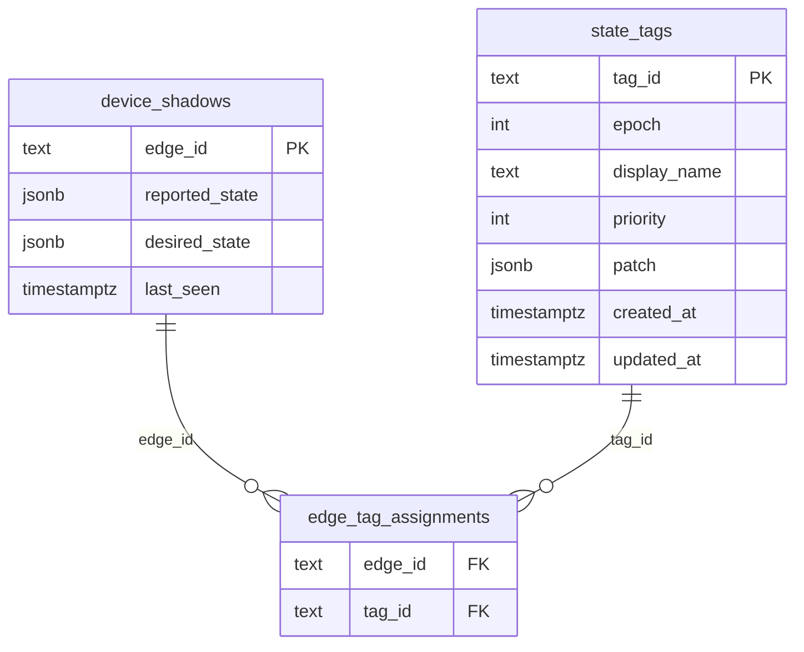
```mermaid
erDiagram
    device_shadows {
        text    edge_id     PK
        jsonb   reported_state
        jsonb   desired_state
        timestamptz last_seen
    }
    state_tags {
        text    tag_id      PK
        int     epoch
        text    display_name
        int     priority
        jsonb   patch
        timestamptz created_at
        timestamptz updated_at
    }
    edge_tag_assignments {
        text    edge_id     FK
        text    tag_id      FK
    }

    device_shadows ||--o{ edge_tag_assignments : "edge_id"
    state_tags    ||--o{ edge_tag_assignments : "tag_id"
```

#### State Synchronization

State synchronization is a critical process in distributed systems, ensuring that all nodes in a network have a eventually consistent view of the system's state.

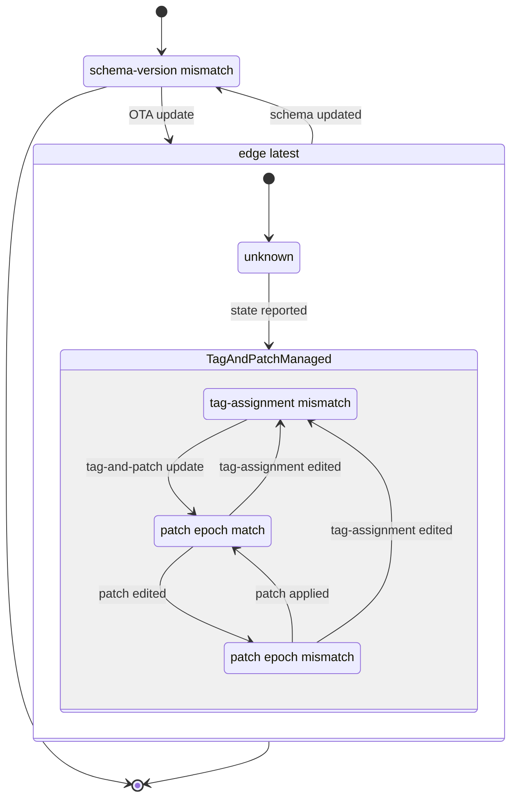
```mermaid

stateDiagram-v2
    state "schema-version mismatch" as SchemaVersionMismatch
    state "tag-assignment mismatch" as TagAssignmentMismatch
    state "patch epoch mismatch" as PatchEpochMismatch
    state "patch epoch match" as PatchEpochMatch
    state "edge latest" as EdgeLatest

    [*] --> SchemaVersionMismatch
    SchemaVersionMismatch --> EdgeLatest: OTA update
    EdgeLatest --> SchemaVersionMismatch: schema updated
    SchemaVersionMismatch --> [*]
    EdgeLatest --> [*]

    state EdgeLatest {
        state "unknown" as Unknown

        [*] --> Unknown

        Unknown --> TagAndPatchManaged: state reported


        state TagAndPatchManaged {
            TagAssignmentMismatch --> PatchEpochMatch: tag-and-patch update
            PatchEpochMismatch --> PatchEpochMatch: patch applied

            PatchEpochMatch --> PatchEpochMismatch: patch edited
            PatchEpochMatch --> TagAssignmentMismatch: tag-assignment edited
            PatchEpochMismatch --> TagAssignmentMismatch: tag-assignment edited

        }
    }
```

#### Shadow Store Layout

Three shadow store variants are configured, each serving a distinct role:

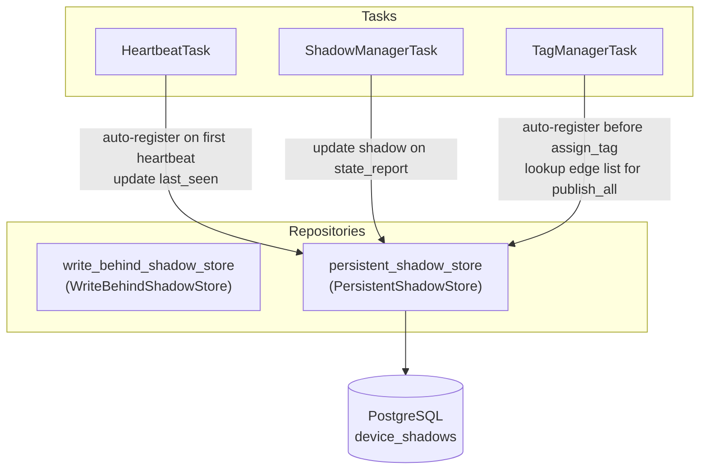
```mermaid
flowchart TB
    subgraph Repositories
        WB["write_behind_shadow_store<br/>(WriteBehindShadowStore)"]
        PS["persistent_shadow_store<br/>(PersistentShadowStore)"]
    end

    subgraph Tasks
        HB["HeartbeatTask"]
        SM["ShadowManagerTask"]
        TM["TagManagerTask"]
    end

    HB -->|"auto-register on first heartbeat<br/>update last_seen"| PS
    SM -->|"update shadow on state_report"| PS
    TM -->|"auto-register before assign_tag<br/>lookup edge list for publish_all"| PS

    PS --> PG[("PostgreSQL<br/>device_shadows")]
```

#### Assign Tag Sequence

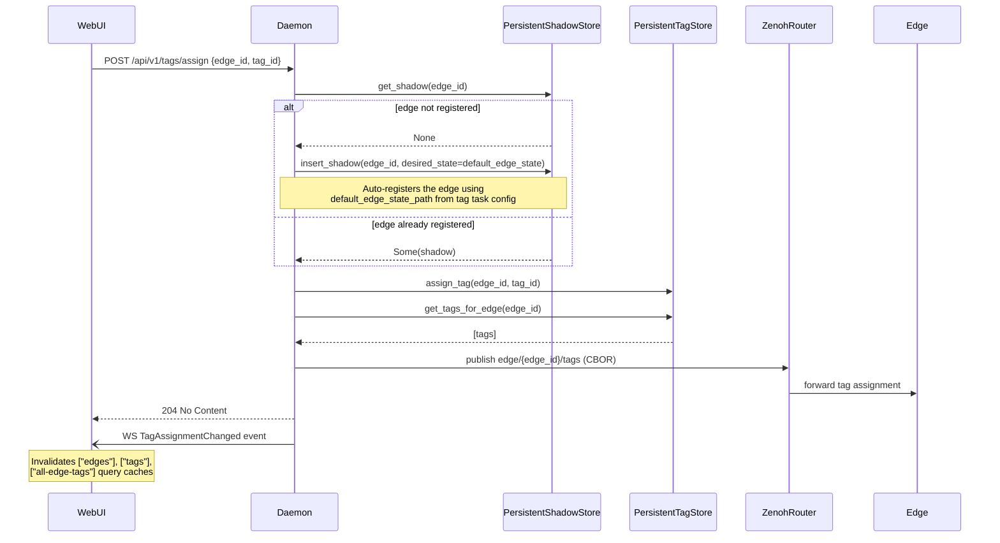
```mermaid

sequenceDiagram
    participant WebUI
    participant Daemon
    participant PersistentShadowStore
    participant PersistentTagStore
    participant ZenohRouter
    participant Edge

    WebUI->>Daemon: POST /api/v1/tags/assign {edge_id, tag_id}
    Daemon->>PersistentShadowStore: get_shadow(edge_id)
    alt edge not registered
        PersistentShadowStore-->>Daemon: None
        Daemon->>PersistentShadowStore: insert_shadow(edge_id, desired_state=default_edge_state)
        Note over Daemon,PersistentShadowStore: Auto-registers the edge using<br/>default_edge_state_path from tag task config
    else edge already registered
        PersistentShadowStore-->>Daemon: Some(shadow)
    end
    Daemon->>PersistentTagStore: assign_tag(edge_id, tag_id)
    Daemon->>PersistentTagStore: get_tags_for_edge(edge_id)
    PersistentTagStore-->>Daemon: [tags]
    Daemon->>ZenohRouter: publish edge/{edge_id}/tags (CBOR)
    ZenohRouter->>Edge: forward tag assignment
    Daemon-->>WebUI: 204 No Content
    Daemon-)WebUI: WS TagAssignmentChanged event
    Note over WebUI: Invalidates ["edges"], ["tags"],<br/>["all-edge-tags"] query caches

```

## Communication (Intent)

- **Control plane**: broadcast and coordination (Zenoh pub/sub).
- **Data plane**: data uploads (TCP).
